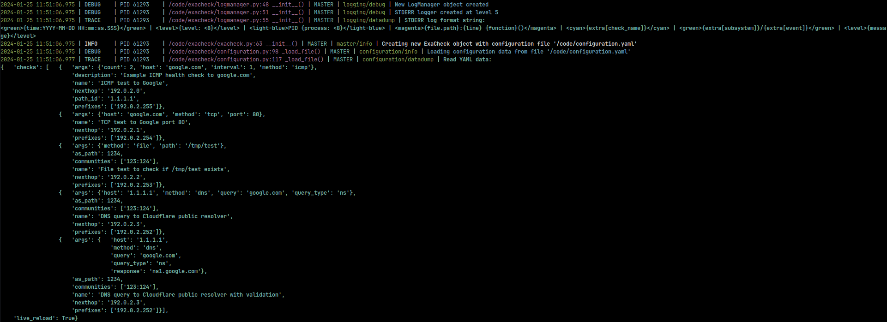

# Logging

[Loguru][Loguru - GitHub] is used to provide detailed logging. By default, logs are sent to STDOUT with the capability of also being logged to files and/or remote syslog servers.

Some of the logging features include:

- Multiple logging targets are supported - Logs may be sent to a remote syslog server and a local file if required.
- Logs can be filtered by level, subsystem, event and health check - Filtering is applied per logging target.
- Structured logging can be enabled for a logging target for easy processing.
- A custom log format may be defined per logging target - if there is logging information that is not relevant to you simply supply your own format.
- If logging to a file, rotation/compression can be handled for you by ExaCheck.

Check the [logging configuration][ExaCheck Configuration - Logging] page to see available options.

An example of the default STDOUT log with verbose logging:

[ExaCheck Configuration - Logging]: ../configuration/logging/index.md
[Loguru - GitHub]: https://github.com/Delgan/loguru
