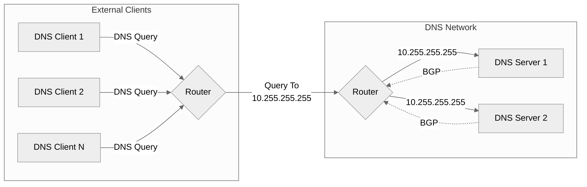

# ExaCheck - ExaBGP Health Checker

Health check services and advertise BGP routes using ExaBGP.
{: .fs-6 .fw-300 }

[Features][ExaCheck Features]{: .btn .btn-blue .fs-5 .mb-4 .mb-md-0 .mr-2 } [Get ExaCheck][ExaCheck Deployment]{: .btn .btn-green .fs-5 .mb-4 .mb-md-0 .mr-2 }

----

[ExaCheck][ExaCheck GitHub] works in conjunction with [ExaBGP][ExaBGP GitHub] to health check services and announce BGP routes based on the availability of those services.

ExaCheck is configured in a YAML based configuration file ([example][ExaCheck Sample Configuration]) which allows for easy configuration of health checks without having to create scripts.

## Example Usage Scenario

As an example, you may have two DNS servers:

- dns1: `10.0.0.1/24`
- dns2: `10.0.0.2/24`

Both DNS servers have an IP bound to them to handle DNS requests: `10.255.255.255` (bound to loopback). You would like to ensure that traffic to `10.255.255.255` is load balanced between the two DNS servers and in case a server fails you would like it to stop receiving traffic:



To achieve this, you would deploy ExaBGP with ExaCheck somewhere; this example assumes it is located on the DNS servers themselves. You would then setup BGP peering between ExaBGP and the router(s) that handle the traffic for `10.0.0.0/24`. ExaCheck would be configured to perform a health check to each server and advertise `10.255.255.255` if a DNS response is received.

The ExaCheck configuration on both DNS servers would look something like this:

```yaml
---

# The list of health checks
checks:

  - name: 10.255.255.255 DNS Service
    description: Perform a basic SOA query for example.com. If the query returns a response, 10.255.255.255 would be advertised with BGP.
    args:
      method: dns
      host: 10.255.255.255
      query: example.com
    prefixes:
      - 10.255.255.255
```

If the DNS service does not respond ExaCheck will then mark the service as down and withdraw the route for that server (providing high availability). When the service is healthy, the router for `10.0.0.0/24` will be able to see two paths for `10.255.255.255` with the same preference/metric thus allowing it to use equal cost multiple multipath or unequal cost multipath (providing load balancing).

With this setup no load balancer hardware/software is required. Depending on the router, they may also handle ECMP at line speed and without state; this can be advantageous for services that experience DDoS attacks due to bypassing a common choke point.

## Why ExaCheck

ExaBGP is packaged with its own health checking script ([see here][ExaBGP Healthcheck]) however it has some limitations which make it not suitable for my requirements.

The built in health check works fine for smaller environments where each service may be running its own instance of ExaBGP (so each instance of ExaBGP runs one or only a few processes) however for larger environments where health checks are centralized it becomes unmanageable.

[ExaCheck GitHub]: https://github.com/exacheck/exacheck
[ExaCheck Features]: /features.html
[ExaCheck Deployment]: /deployment.html
[ExaCheck Sample Configuration]: https://github.com/exacheck/exacheck/blob/main/configuration.yaml
[ExaBGP GitHub]: https://github.com/Exa-Networks/exabgp
[ExaBGP Healthcheck]: https://github.com/Exa-Networks/exabgp/blob/main/src/exabgp/application/healthcheck.py
